# Implementation Plan — businessrules

> **Created:** 2026-03-15
> **Goal:** Extract `github.com/artmann/businessrules` as a standalone Go library
> **Strategy:** Pareto-driven execution (1% → 51%, 4% → 64%, 20% → 80%)

---

## Pareto Breakdown

### 1% → 51% Impact (6 tasks, ~45 min)

The absolute minimum for a working library - you can define and run rules.

| # | Task                                             | Effort | Impact   |
| - | ------------------------------------------------ | ------ | -------- |
| 1 | Initialize Go module                             | 5min   | CRITICAL |
| 2 | Create `severity.go` (Severity type + constants) | 10min  | CRITICAL |
| 3 | Create `rule.go` (Rule interface + baseRule)     | 15min  | CRITICAL |
| 4 | Create `errors.go` (Violation struct)            | 5min   | CRITICAL |
| 5 | Create `result.go` (Result struct + Valid field) | 10min  | CRITICAL |
| 6 | Create `validator.go` (ValidatorBuilder + Build) | 10min  | CRITICAL |

**Deliverable:** Library compiles, you can create custom rules and validate.

---

### 4% → 64% Impact (+8 tasks, ~45 min additional)

Adds filtering and basic pre-built rules - now actually useful.

| #  | Task                                               | Effort | Impact |
| -- | -------------------------------------------------- | ------ | ------ |
| 7  | Implement `Result.Errors/Warnings/Info/Critical()` | 10min  | HIGH   |
| 8  | Implement `Result.HasErrors/HasWarnings()`         | 5min   | HIGH   |
| 9  | Implement `NonNegative()` builder                  | 5min   | HIGH   |
| 10 | Implement `Positive()` builder                     | 5min   | HIGH   |
| 11 | Implement `NotEmpty()` builder                     | 5min   | HIGH   |
| 12 | Implement `InRange()` builder                      | 5min   | HIGH   |
| 13 | Create `severity_test.go`                          | 10min  | HIGH   |
| 14 | Verify build passes                                | 5min   | HIGH   |

**Deliverable:** Usable library with severity filtering and common validators.

---

### 20% → 80% Impact (+10 tasks, ~1 hour additional)

Complete pre-built rules and comprehensive testing.

| #  | Task                            | Effort | Impact |
| -- | ------------------------------- | ------ | ------ |
| 15 | Implement `MinInt()` builder    | 5min   | MEDIUM |
| 16 | Implement `MaxInt()` builder    | 5min   | MEDIUM |
| 17 | Implement `MaxLength()` builder | 5min   | MEDIUM |
| 18 | Implement `Matches()` builder   | 5min   | MEDIUM |
| 19 | Implement `OneOf[T]()` builder  | 10min  | MEDIUM |
| 20 | Implement `Custom()` builder    | 5min   | MEDIUM |
| 21 | Create `rule_test.go`           | 15min  | HIGH   |
| 22 | Create `result_test.go`         | 15min  | HIGH   |
| 23 | Create `validator_test.go`      | 10min  | HIGH   |
| 24 | Create `builders_test.go`       | 20min  | HIGH   |

**Deliverable:** Fully functional library with all pre-built rules and tests.

---

### Remaining 80% → Final 20% (+10 tasks, ~1 hour)

Examples, edge cases, documentation, quality gates.

| #  | Task                              | Effort | Impact |
| -- | --------------------------------- | ------ | ------ |
| 25 | Create `errors_test.go`           | 10min  | MEDIUM |
| 26 | Create `examples/basic_test.go`   | 15min  | MEDIUM |
| 27 | Verify 95%+ test coverage         | 10min  | MEDIUM |
| 28 | Run `go vet ./...`                | 5min   | MEDIUM |
| 29 | Verify file line limits (≤250)    | 5min   | LOW    |
| 30 | Verify function line limits (≤30) | 5min   | LOW    |
| 31 | Verify no `any` types             | 5min   | LOW    |
| 32 | Add MIT LICENSE                   | 5min   | LOW    |
| 33 | Update README if needed           | 10min  | LOW    |
| 34 | Final commit and verify           | 5min   | LOW    |

---

## Execution Flow

```mermaid
flowchart TD
    subgraph P1["1% → 51% (~45min)"]
        A1[Init Go Module] --> A2[severity.go]
        A2 --> A3[rule.go]
        A3 --> A4[errors.go]
        A4 --> A5[result.go]
        A5 --> A6[validator.go]
    end

    subgraph P2["4% → 64% (+45min)"]
        B1[Result Accessors] --> B2[NonNegative]
        B2 --> B3[Positive]
        B3 --> B4[NotEmpty]
        B4 --> B5[InRange]
        B5 --> B6[severity_test.go]
        B6 --> B7[Build Verification]
    end

    subgraph P3["20% → 80% (+1hr)"]
        C1[MinInt/MaxInt] --> C2[MaxLength]
        C2 --> C3[Matches]
        C3 --> C4[OneOf]
        C4 --> C5[Custom]
        C5 --> C6[Core Tests]
        C6 --> C7[builders_test.go]
    end

    subgraph P4["Final 20% (+1hr)"]
        D1[errors_test.go] --> D2[Examples]
        D2 --> D3[Coverage Check]
        D3 --> D4[Quality Gates]
        D4 --> D5[LICENSE]
        D5 --> D6[Final Commit]
    end

    A6 --> B1
    B7 --> C1
    C7 --> D1
```

---

## Detailed Task List (15min max per task)

| #  | Task                                | File              | Effort | Status  |
| -- | ----------------------------------- | ----------------- | ------ | ------- |
| 1  | Initialize Go module                | go.mod            | 5min   | pending |
| 2  | Add cockroachdb/errors dependency   | go.mod            | 2min   | pending |
| 3  | Add ginkgo/gomega dev dependencies  | go.mod            | 3min   | pending |
| 4  | Create Severity type with constants | severity.go       | 10min  | pending |
| 5  | Implement Severity.String()         | severity.go       | 3min   | pending |
| 6  | Create Rule interface               | rule.go           | 5min   | pending |
| 7  | Implement baseRule struct           | rule.go           | 10min  | pending |
| 8  | Create Violation struct             | errors.go         | 5min   | pending |
| 9  | Implement Violation.Error()         | errors.go         | 3min   | pending |
| 10 | Create Result struct                | result.go         | 5min   | pending |
| 11 | Implement Result.Errors()           | result.go         | 5min   | pending |
| 12 | Implement Result.Warnings()         | result.go         | 3min   | pending |
| 13 | Implement Result.Info()             | result.go         | 3min   | pending |
| 14 | Implement Result.Critical()         | result.go         | 3min   | pending |
| 15 | Implement Result.HasErrors()        | result.go         | 2min   | pending |
| 16 | Implement Result.HasWarnings()      | result.go         | 2min   | pending |
| 17 | Implement Result.HasCritical()      | result.go         | 2min   | pending |
| 18 | Create ValidatorBuilder             | validator.go      | 5min   | pending |
| 19 | Implement AddRule()                 | validator.go      | 3min   | pending |
| 20 | Implement AddRules()                | validator.go      | 2min   | pending |
| 21 | Implement Build()                   | validator.go      | 5min   | pending |
| 22 | Implement NonNegative()             | builders.go       | 5min   | pending |
| 23 | Implement Positive()                | builders.go       | 5min   | pending |
| 24 | Implement InRange()                 | builders.go       | 5min   | pending |
| 25 | Implement MinInt()                  | builders.go       | 5min   | pending |
| 26 | Implement MaxInt()                  | builders.go       | 5min   | pending |
| 27 | Implement NotEmpty()                | builders.go       | 5min   | pending |
| 28 | Implement MaxLength()               | builders.go       | 5min   | pending |
| 29 | Implement Matches()                 | builders.go       | 5min   | pending |
| 30 | Implement OneOf[T]()                | builders.go       | 10min  | pending |
| 31 | Implement Custom()                  | builders.go       | 5min   | pending |
| 32 | Create severity_test.go             | severity_test.go  | 10min  | pending |
| 33 | Create rule_test.go                 | rule_test.go      | 10min  | pending |
| 34 | Create errors_test.go               | errors_test.go    | 10min  | pending |
| 35 | Create result_test.go               | result_test.go    | 15min  | pending |
| 36 | Create validator_test.go            | validator_test.go | 10min  | pending |
| 37 | Create builders_test.go             | builders_test.go  | 15min  | pending |
| 38 | Create basic example                | examples/         | 15min  | pending |
| 39 | Run go build ./...                  | -                 | 2min   | pending |
| 40 | Run go test ./...                   | -                 | 5min   | pending |
| 41 | Verify 95%+ coverage                | -                 | 5min   | pending |
| 42 | Run go vet ./...                    | -                 | 2min   | pending |
| 43 | Verify file limits                  | -                 | 3min   | pending |
| 44 | Verify function limits              | -                 | 3min   | pending |
| 45 | Verify no any types                 | -                 | 2min   | pending |
| 46 | Add MIT LICENSE                     | LICENSE           | 2min   | pending |
| 47 | Final commit                        | -                 | 5min   | pending |

---

## Success Criteria

- [x] Repository initialized
- [x] README.md created
- [x] Documentation complete
- [ ] Go module initialized
- [ ] All source files created (severity.go, rule.go, errors.go, result.go, validator.go, builders.go)
- [ ] All test files created with Ginkgo/Gomega
- [ ] Build passes: `go build ./...`
- [ ] Tests pass: `go test ./...`
- [ ] Coverage ≥95%: `go test -cover ./...`
- [ ] No `any` types
- [ ] Files ≤250 lines
- [ ] Functions ≤30 lines
- [ ] MIT LICENSE added
- [ ] Final commit and push

---

## Notes

- Using `cockroachdb/errors` for error handling (allowed by library-policy)
- Using `onsi/ginkgo/v2` + `onsi/gomega` for testing (NOT testify which is banned)
- Integration target: `sivchari/govalid` (NOT go-playground/validator which is banned)
- No runtime dependencies except cockroachdb/errors

---

_Generated: 2026-03-15_
