# Implementation Plan — businessrules

> **Created:** 2026-03-15
> **Goal:** Extract `github.com/artmann/businessrules` as a standalone Go library
> **Strategy:** Pareto-driven execution (1% → 51%, 4% → 64%, 20% → 80%)

---

## Pareto Breakdown

### 1% → 51% Impact (6 tasks, ~45 min)

The absolute minimum for a working library - you can define and run rules.

| # | Task                                             | Effort | Impact   |
| - | ------------------------------------------------ | ------ | -------- |
| ~~1~~ | ~~Initialize Go module~~ done — shipped | ~~5min~~ | ~~CRITICAL~~ |
| ~~2~~ | ~~Create `severity.go` (Severity type + constants)~~ done — shipped | ~~10min~~ | ~~CRITICAL~~ |
| ~~3~~ | ~~Create `rule.go` (Rule interface + baseRule)~~ done — shipped | ~~15min~~ | ~~CRITICAL~~ |
| ~~4~~ | ~~Create `errors.go` (Violation struct)~~ done — shipped | ~~5min~~ | ~~CRITICAL~~ |
| ~~5~~ | ~~Create `result.go` (Result struct + Valid field)~~ done — shipped | ~~10min~~ | ~~CRITICAL~~ |
| ~~6~~ | ~~Create `validator.go` (ValidatorBuilder + Build)~~ done — shipped | ~~10min~~ | ~~CRITICAL~~ |

**Deliverable:** Library compiles, you can create custom rules and validate.

---

### 4% → 64% Impact (+8 tasks, ~45 min additional)

Adds filtering and basic pre-built rules - now actually useful.

| #  | Task                                               | Effort | Impact |
| -- | -------------------------------------------------- | ------ | ------ |
| ~~7~~  | ~~Implement `Result.Errors/Warnings/Info/Critical()`~~ done — shipped | ~~10min~~ | ~~HIGH~~ |
| ~~8~~  | ~~Implement `Result.HasErrors/HasWarnings()`~~ done — shipped | ~~5min~~ | ~~HIGH~~ |
| ~~9~~  | ~~Implement `NonNegative()` builder~~ done — shipped | ~~5min~~ | ~~HIGH~~ |
| ~~10~~ | ~~Implement `Positive()` builder~~ done — shipped | ~~5min~~ | ~~HIGH~~ |
| ~~11~~ | ~~Implement `NotEmpty()` builder~~ done — shipped | ~~5min~~ | ~~HIGH~~ |
| ~~12~~ | ~~Implement `InRange()` builder~~ done — shipped | ~~5min~~ | ~~HIGH~~ |
| ~~13~~ | ~~Create `severity_test.go`~~ done — shipped | ~~10min~~ | ~~HIGH~~ |
| ~~14~~ | ~~Verify build passes~~ done — shipped | ~~5min~~ | ~~HIGH~~ |

**Deliverable:** Usable library with severity filtering and common validators.

---

### 20% → 80% Impact (+10 tasks, ~1 hour additional)

Complete pre-built rules and comprehensive testing.

| #  | Task                            | Effort | Impact |
| -- | ------------------------------- | ------ | ------ |
| ~~15~~ | ~~Implement `MinInt()` builder~~ done — shipped | ~~5min~~ | ~~MEDIUM~~ |
| ~~16~~ | ~~Implement `MaxInt()` builder~~ done — shipped | ~~5min~~ | ~~MEDIUM~~ |
| ~~17~~ | ~~Implement `MaxLength()` builder~~ done — shipped | ~~5min~~ | ~~MEDIUM~~ |
| ~~18~~ | ~~Implement `Matches()` builder~~ done — shipped | ~~5min~~ | ~~MEDIUM~~ |
| ~~19~~ | ~~Implement `OneOf[T]()` builder~~ done — shipped | ~~10min~~ | ~~MEDIUM~~ |
| ~~20~~ | ~~Implement `Custom()` builder~~ done — shipped | ~~5min~~ | ~~MEDIUM~~ |
| ~~21~~ | ~~Create `rule_test.go`~~ done — shipped | ~~15min~~ | ~~HIGH~~ |
| ~~22~~ | ~~Create `result_test.go`~~ done — shipped | ~~15min~~ | ~~HIGH~~ |
| ~~23~~ | ~~Create `validator_test.go`~~ done — shipped | ~~10min~~ | ~~HIGH~~ |
| ~~24~~ | ~~Create `builders_test.go`~~ done — shipped | ~~20min~~ | ~~HIGH~~ |

**Deliverable:** Fully functional library with all pre-built rules and tests.

---

### Remaining 80% → Final 20% (+10 tasks, ~1 hour)

Examples, edge cases, documentation, quality gates.

| #  | Task                              | Effort | Impact |
| -- | --------------------------------- | ------ | ------ |
| ~~25~~ | ~~Create `errors_test.go`~~ done — shipped | ~~10min~~ | ~~MEDIUM~~ |
| ~~26~~ | ~~Create `examples/basic_test.go`~~ done — shipped | ~~15min~~ | ~~MEDIUM~~ |
| ~~27~~ | ~~Verify 95%+ test coverage~~ done — shipped | ~~10min~~ | ~~MEDIUM~~ |
| ~~28~~ | ~~Run `go vet ./...`~~ done — shipped | ~~5min~~ | ~~MEDIUM~~ |
| ~~29~~ | ~~Verify file line limits (≤250)~~ done — shipped | ~~5min~~ | ~~LOW~~ |
| ~~30~~ | ~~Verify function line limits (≤30)~~ done — shipped | ~~5min~~ | ~~LOW~~ |
| ~~31~~ | ~~Verify no `any` types~~ done — shipped | ~~5min~~ | ~~LOW~~ |
| ~~32~~ | ~~Add MIT LICENSE~~ done — shipped | ~~5min~~ | ~~LOW~~ |
| ~~33~~ | ~~Update README if needed~~ done — shipped | ~~10min~~ | ~~LOW~~ |
| ~~34~~ | ~~Final commit and verify~~ done — shipped | ~~5min~~ | ~~LOW~~ |

---

## Execution Flow

```mermaid
flowchart TD
    subgraph P1["1% → 51% (~45min)"]
        A1[Init Go Module] --> A2[severity.go]
        A2 --> A3[rule.go]
        A3 --> A4[errors.go]
        A4 --> A5[result.go]
        A5 --> A6[validator.go]
    end

    subgraph P2["4% → 64% (+45min)"]
        B1[Result Accessors] --> B2[NonNegative]
        B2 --> B3[Positive]
        B3 --> B4[NotEmpty]
        B4 --> B5[InRange]
        B5 --> B6[severity_test.go]
        B6 --> B7[Build Verification]
    end

    subgraph P3["20% → 80% (+1hr)"]
        C1[MinInt/MaxInt] --> C2[MaxLength]
        C2 --> C3[Matches]
        C3 --> C4[OneOf]
        C4 --> C5[Custom]
        C5 --> C6[Core Tests]
        C6 --> C7[builders_test.go]
    end

    subgraph P4["Final 20% (+1hr)"]
        D1[errors_test.go] --> D2[Examples]
        D2 --> D3[Coverage Check]
        D3 --> D4[Quality Gates]
        D4 --> D5[LICENSE]
        D5 --> D6[Final Commit]
    end

    A6 --> B1
    B7 --> C1
    C7 --> D1
```

---

## Detailed Task List (15min max per task)

| #  | Task                                | File              | Effort | Status  |
| -- | ----------------------------------- | ----------------- | ------ | ------- |
| ~~1~~  | ~~Initialize Go module~~ done — shipped | ~~go.mod~~ | ~~5min~~ | ~~pending~~ |
| ~~2~~  | ~~Add cockroachdb/errors dependency~~ done — shipped | ~~go.mod~~ | ~~2min~~ | ~~pending~~ |
| ~~3~~  | ~~Add ginkgo/gomega dev dependencies~~ done — shipped | ~~go.mod~~ | ~~3min~~ | ~~pending~~ |
| ~~4~~  | ~~Create Severity type with constants~~ done — shipped | ~~severity.go~~ | ~~10min~~ | ~~pending~~ |
| ~~5~~  | ~~Implement Severity.String()~~ done — shipped | ~~severity.go~~ | ~~3min~~ | ~~pending~~ |
| ~~6~~  | ~~Create Rule interface~~ done — shipped | ~~rule.go~~ | ~~5min~~ | ~~pending~~ |
| ~~7~~  | ~~Implement baseRule struct~~ done — shipped | ~~rule.go~~ | ~~10min~~ | ~~pending~~ |
| ~~8~~  | ~~Create Violation struct~~ done — shipped | ~~errors.go~~ | ~~5min~~ | ~~pending~~ |
| ~~9~~  | ~~Implement Violation.Error()~~ done — shipped | ~~errors.go~~ | ~~3min~~ | ~~pending~~ |
| ~~10~~ | ~~Create Result struct~~ done — shipped | ~~result.go~~ | ~~5min~~ | ~~pending~~ |
| ~~11~~ | ~~Implement Result.Errors()~~ done — shipped | ~~result.go~~ | ~~5min~~ | ~~pending~~ |
| ~~12~~ | ~~Implement Result.Warnings()~~ done — shipped | ~~result.go~~ | ~~3min~~ | ~~pending~~ |
| ~~13~~ | ~~Implement Result.Info()~~ done — shipped | ~~result.go~~ | ~~3min~~ | ~~pending~~ |
| ~~14~~ | ~~Implement Result.Critical()~~ done — shipped | ~~result.go~~ | ~~3min~~ | ~~pending~~ |
| ~~15~~ | ~~Implement Result.HasErrors()~~ done — shipped | ~~result.go~~ | ~~2min~~ | ~~pending~~ |
| ~~16~~ | ~~Implement Result.HasWarnings()~~ done — shipped | ~~result.go~~ | ~~2min~~ | ~~pending~~ |
| ~~17~~ | ~~Implement Result.HasCritical()~~ done — shipped | ~~result.go~~ | ~~2min~~ | ~~pending~~ |
| ~~18~~ | ~~Create ValidatorBuilder~~ done — shipped | ~~validator.go~~ | ~~5min~~ | ~~pending~~ |
| ~~19~~ | ~~Implement AddRule()~~ done — shipped | ~~validator.go~~ | ~~3min~~ | ~~pending~~ |
| ~~20~~ | ~~Implement AddRules()~~ done — shipped | ~~validator.go~~ | ~~2min~~ | ~~pending~~ |
| ~~21~~ | ~~Implement Build()~~ done — shipped | ~~validator.go~~ | ~~5min~~ | ~~pending~~ |
| ~~22~~ | ~~Implement NonNegative()~~ done — shipped | ~~builders.go~~ | ~~5min~~ | ~~pending~~ |
| ~~23~~ | ~~Implement Positive()~~ done — shipped | ~~builders.go~~ | ~~5min~~ | ~~pending~~ |
| ~~24~~ | ~~Implement InRange()~~ done — shipped | ~~builders.go~~ | ~~5min~~ | ~~pending~~ |
| ~~25~~ | ~~Implement MinInt()~~ done — shipped | ~~builders.go~~ | ~~5min~~ | ~~pending~~ |
| ~~26~~ | ~~Implement MaxInt()~~ done — shipped | ~~builders.go~~ | ~~5min~~ | ~~pending~~ |
| ~~27~~ | ~~Implement NotEmpty()~~ done — shipped | ~~builders.go~~ | ~~5min~~ | ~~pending~~ |
| ~~28~~ | ~~Implement MaxLength()~~ done — shipped | ~~builders.go~~ | ~~5min~~ | ~~pending~~ |
| ~~29~~ | ~~Implement Matches()~~ done — shipped | ~~builders.go~~ | ~~5min~~ | ~~pending~~ |
| ~~30~~ | ~~Implement OneOf[T]()~~ done — shipped | ~~builders.go~~ | ~~10min~~ | ~~pending~~ |
| ~~31~~ | ~~Implement Custom()~~ done — shipped | ~~builders.go~~ | ~~5min~~ | ~~pending~~ |
| ~~32~~ | ~~Create severity_test.go~~ done — shipped | ~~severity_test.go~~ | ~~10min~~ | ~~pending~~ |
| ~~33~~ | ~~Create rule_test.go~~ done — shipped | ~~rule_test.go~~ | ~~10min~~ | ~~pending~~ |
| ~~34~~ | ~~Create errors_test.go~~ done — shipped | ~~errors_test.go~~ | ~~10min~~ | ~~pending~~ |
| ~~35~~ | ~~Create result_test.go~~ done — shipped | ~~result_test.go~~ | ~~15min~~ | ~~pending~~ |
| ~~36~~ | ~~Create validator_test.go~~ done — shipped | ~~validator_test.go~~ | ~~10min~~ | ~~pending~~ |
| ~~37~~ | ~~Create builders_test.go~~ done — shipped | ~~builders_test.go~~ | ~~15min~~ | ~~pending~~ |
| ~~38~~ | ~~Create basic example~~ done — shipped | ~~examples/~~ | ~~15min~~ | ~~pending~~ |
| ~~39~~ | ~~Run go build ./...~~ done — shipped | ~~-~~ | ~~2min~~ | ~~pending~~ |
| ~~40~~ | ~~Run go test ./...~~ done — shipped | ~~-~~ | ~~5min~~ | ~~pending~~ |
| ~~41~~ | ~~Verify 95%+ coverage~~ done — shipped | ~~-~~ | ~~5min~~ | ~~pending~~ |
| ~~42~~ | ~~Run go vet ./...~~ done — shipped | ~~-~~ | ~~2min~~ | ~~pending~~ |
| ~~43~~ | ~~Verify file limits~~ done — shipped | ~~-~~ | ~~3min~~ | ~~pending~~ |
| ~~44~~ | ~~Verify function limits~~ done — shipped | ~~-~~ | ~~3min~~ | ~~pending~~ |
| ~~45~~ | ~~Verify no any types~~ done — shipped | ~~-~~ | ~~2min~~ | ~~pending~~ |
| ~~46~~ | ~~Add MIT LICENSE~~ done — shipped | ~~LICENSE~~ | ~~2min~~ | ~~pending~~ |
| ~~47~~ | ~~Final commit~~ done — shipped | ~~-~~ | ~~5min~~ | ~~pending~~ |

---

## Success Criteria

- [x] ~~Repository initialized~~
- [x] ~~README.md created~~
- [x] ~~Documentation complete~~
- [x] ~~Go module initialized~~
- [x] ~~All source files created (severity.go, rule.go, errors.go, result.go, validator.go, builders.go)~~
- [x] ~~All test files created with Ginkgo/Gomega~~
- [x] ~~Build passes: `go build ./...`~~
- [x] ~~Tests pass: `go test ./...`~~
- [x] ~~Coverage ≥95%: `go test -cover ./...`~~ (95.9% measured 2026-09-14)
- [x] ~~No `any` types~~
- [x] ~~Files ≤250 lines~~
- [x] ~~Functions ≤30 lines~~
- [x] ~~MIT LICENSE added~~
- [x] ~~Final commit and push~~

---

## Notes

- ~~Using `cockroachdb/errors` for error handling (allowed by library-policy)~~ Dropped during implementation — stdlib `fmt.Errorf` only.
- Using `onsi/ginkgo/v2` + `onsi/gomega` for testing (NOT testify which is banned)
- Integration target: `sivchari/govalid` (NOT go-playground/validator which is banned)
- ~~No runtime dependencies except cockroachdb/errors~~ One runtime dependency since `e423de4`: `go-finding` (shared `Severity`).

---

_Generated: 2026-03-15_

---

## Resolution (2026-09-14)

Plan fully executed the same day (see the status reports of 2026-03-15). Every task shipped; the success criteria all pass. Two notes drifted: `cockroachdb/errors` was dropped in favor of stdlib errors, and the library later gained one runtime dependency (`go-finding`). Open follow-up work lives in `TODO_LIST.md` / `ROADMAP.md`. Archived.
