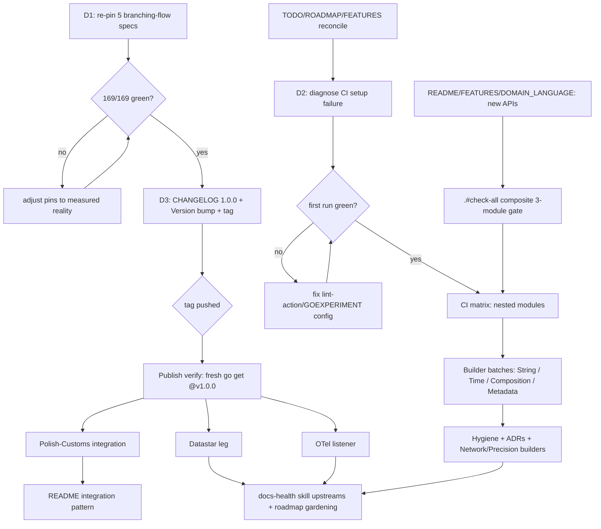

# Plan: Green Suite → Consumable Module → Release Train

> **Created:** 2026-09-14 16:15 CEST
> **Goal:** Turn today's feature-rich but logistically jammed library into something a consumer can actually `go get`, guarded by a green suite and honest CI — then build the ecosystem out.
> **Constraint:** ZERO breaking changes to the public API. Every tier is independently shippable. No Verschlimmbessern: each task carries its own verification gate.

---

## 0. Context & Ground Truth (measured 2026-09-14 16:08)

| Fact                                                      | Evidence                                                              |
| --------------------------------------------------------- | ---------------------------------------------------------------------- |
| 169 specs, **164 pass / 5 fail** — all 5 are branching-flow count pins | `go test ./...` — pins drifted 2→5 when the 16:0x session added context/concurrency code (analyzer scans whole dir, no path-exclude) |
| Build OK; the suite was red only at the count pins         | `go build ./...` clean                                                 |
| Concurrent 16:0x session shipped 4 TODO items              | `CheckContext` + `ContextRuleImpl` (`rule.go`), `WithConcurrency` (`validator.go:58`), `BenchmarkStream*` ×3, goroutine-leak specs (`stream_test.go:243+`) |
| CI workflow `disabled_manually` since 2026-07-17           | `gh workflow list --all`                                               |
| Repo **private**; proxy/pkg.go.dev serve nothing           | `gh repo view --json visibility`; proxy `@v/list` 404                  |
| Tag `v2.0.0` exists but is not Go-consumable (no `/v2` path suffix); only `v0.1.0` resolves | `go.mod` module path; proxy listing                    |
| Nested modules (`adapters/cqrslite`, `examples/sse`) tested only via `replace ../..` | root CI/lint does not cover them        |
| New APIs absent from README/FEATURES/DOMAIN_LANGUAGE       | grep for `CheckContext` in `README.md` → none                          |

**Standing decisions this plan recommends** (each is reversible; blast radius stated per task):

| # | Decision                  | Recommendation                                                     | Alternative, dismissed                              |
| - | ------------------------- | ------------------------------------------------------------------- | ----------------------------------------------------- |
| D1 | Branching-flow pins (5)  | **Re-pin to current reality** with a dated comment — a red suite poisons all signal; the false-positive classes are documented in AGENTS.md | Nightly job — extra infra for a marginal detector; reject |
| D2 | CI endgame               | **Re-enable + diagnose the June 3-5s setup failure first** — remote verification matters before the first real release | Delete workflow — loses release-tag verification; reject for now |
| D3 | Module versioning        | **Tag `v1.0.0` at HEAD** (unsuffixed path, fully Go-compliant; v2.0.0 tag documented as unconsumable in CHANGELOG) | `/v2` rename — breaks every future import path for zero existing consumers; defer until one demands it |
| D4 | Repo visibility          | **Keep private** (status quo); plan works unchanged if made public later | —                                                  |
| D5 | Adapter home             | **Keep nested modules**; promote to sibling repos only when a second consumer appears | —                                                  |

---

## 1. Pareto Breakdown

### The 1% → 51% of value: **A green suite + a consumable module**

Five red specs mean every future change is verified against a lying baseline. An unresolvable module tag means the library cannot be consumed at all. Re-pinning (D1), tagging `v1.0.0` (D3), and reconciling the backlog (so it stops lying) unlock: releases, adapter publishing, consumer integration, and honest verification for everything below.

### The 4% → 64% (1% + this): **The release train + its guardrails**

Promote the CHANGELOG, verify the tag actually resolves, document the new context/concurrency APIs (they shipped undocumented), and add the composite 3-module gate so the nested modules stop being second-class. Re-enable CI (D2) + nested matrix.

### The 20% → 80% (4% + this): **First real consumer + ecosystem proof**

Polish-Customs integration (the only true external validation of the breaking-change surface), Datastar leg, OTel listener — the parts that make events/streaming/context *real*.

### The remaining 80% → 100%

ROADMAP builders (String, Time/Date, Network/ID, Precision), composition (`Not`/`Or`/`Xor`), rule metadata, event candidates (Run ID, tags, scheduler, backpressure, signing), property-based `Build`≡`Stream` equivalence, hygiene (CODEOWNERS, SECURITY.md, templates, ADRs), docs-health skill upstreams, standing items (`json/v2` graduation tracking, art-dupl claim re-verification).

---

## 2. Comprehensive Plan (30-100 min tasks, sorted by impact/effort/value)

| #   | Task                                                                                                              | Effort  | Impact   | Tier | Depends |
| --- | ------------------------------------------------------------------------------------------------------------------- | ------- | -------- | ---- | ------- |
| 1   | Apply D1: re-pin the 5 branching-flow specs to current reality, each with a dated `// re-pinned 2026-09-14` comment; suite green (169/169) | 45 min  | CRITICAL | 1%   | —       |
| 2   | Apply D3: promote CHANGELOG `[Unreleased]` → `[1.0.0]` (incl. today's context/concurrency features), add v2.0.0-unconsumable note, tag `v1.0.0` | 90 min  | CRITICAL | 1%   | 1       |
| 3   | Publish verification: fresh-cache `go get github.com/LarsArtmann/go-business-rules@v1.0.0` in a scratch module with GOPRIVATE; confirm resolution | 30 min  | CRITICAL | 1%   | 2       |
| 4   | Reconcile TODO_LIST/ROADMAP/FEATURES with today's shipments (4 items + 5-pin drift already partially done in the 16:10 pass) | 45 min  | HIGH     | 1%   | —       |
| 5   | Document new APIs: README (CheckContext, ContextRuleImpl, WithConcurrency, Stream examples), FEATURES rows, DOMAIN_LANGUAGE terms | 60 min  | HIGH     | 4%   | —       |
| 6   | CHANGELOG `[Unreleased]`→`[1.0.0]` content completeness pass: benchmarks, goroutine-leak specs, context rules entry text | 45 min  | MEDIUM   | 4%   | 2       |
| 7   | Composite 3-module gate: flake app `.#check-all` running build+test+lint for root, `adapters/cqrslite`, `examples/sse` in sequence | 60 min  | HIGH     | 4%   | —       |
| 8   | Apply D2: diagnose June CI setup failure (golangci-lint-action v7 vs Go 1.26/GOEXPERIMENT hypothesis), fix, re-enable workflow | 90 min  | HIGH     | 4%   | 1       |
| 9   | CI matrix: nested-module jobs for `adapters/cqrslite` + `examples/sse` (uses `.#check-all` or direct matrix)          | 60 min  | MEDIUM   | 4%   | 8       |
| 10  | README release notes: installation section rewrite for the v1.0.0 reality + versioning note link                     | 30 min  | MEDIUM   | 4%   | 3       |
| 11  | Polish-Customs integration phase 1: add dependency, replace `validation.go`, run their tests                        | 100 min | HIGH     | 20%  | 3       |
| 12  | Polish-Customs integration phase 2: fix fallout, document integration pattern in README                              | 100 min | MEDIUM   | 20%  | 11      |
| 13  | Datastar leg for `examples/sse`: signals/patches via `sse.Broadcaster`                                              | 100 min | MEDIUM   | 20%  | —       |
| 14  | OTel listener nested module: `RuleEvaluated`/`ValidationCompleted` → spans/metrics                                    | 100 min | MEDIUM   | 20%  | —       |
| 15  | String builders batch: `Contains`, `LengthRange`, `Required`, `MatchesFunc` + specs                                 | 90 min  | MEDIUM   | 80%  | —       |
| 16  | Time/Date builders batch: `NotPast`, `NotFuture`, `DateInRange` + specs                                             | 100 min | MEDIUM   | 80%  | —       |
| 17  | Composition: `Not`, `Or`, `Xor` + specs (reuse composite strategy pattern)                                           | 90 min  | MEDIUM   | 80%  | —       |
| 18  | Rule metadata: `Description()`/`Tags()` on `RuleImpl` + surfaced on `RuleEvaluated`                                  | 90 min  | MEDIUM   | 80%  | —       |
| 19  | Property-based `Build`≡`Stream` equivalence (gopter), added as opt-in long test                                      | 100 min | LOW      | 80%  | —       |
| 20  | Hygiene batch: `.github/CODEOWNERS`, `SECURITY.md`, issue/PR templates                                               | 60 min  | LOW      | 80%  | —       |
| 21  | ADR batch: type rename, `finding.Severity` migration, json/v2 adoption (`docs/adr/`)                                | 90 min  | LOW      | 80%  | —       |
| 22  | Network/ID builders batch: `IPAddress`, `CreditCard`, `PhoneNumber`, `PostalCode` + specs                            | 100 min | LOW      | 80%  | —       |
| 23  | Precision builders: `MaxDecimalPlaces`, `DivisibleBy` + specs                                                       | 60 min  | LOW      | 80%  | —       |
| 24  | docs-health skill upstreams: level-aware scoping, annotate-completeness grep, CI-badge/visibility probes             | 60 min  | LOW      | 80%  | —       |
| 25  | Roadmap gardening, events-candidates assessment (Run ID, scheduler, backpressure, signing), and one-shot `art-dupl` run to verify/soften the AGENTS.md zero-clones claim | 30 min  | LOW      | 80%  | —       |

---

## 3. Detailed Breakdown (≤12 min tasks)

| #    | Task                                                                                  | Time | Depends |
| ---- | --------------------------------------------------------------------------------------- | ---- | ------- |
| 1.1  | Run branching-flow `phantom --format finding` + `stats`; record actual counts            | 8min | —       |
| 1.2  | Re-pin PHANTOM total spec (line ~102) to actual, dated comment                           | 6min | 1.1     |
| 1.3  | Re-pin severity-distribution specs (line ~109) to actual                                 | 6min | 1.1     |
| 1.4  | Re-pin `stats` total spec (line ~181) to actual                                          | 6min | 1.1     |
| 1.5  | Re-pin `all`-output spec (line ~43) to actual                                            | 6min | 1.1     |
| 1.6  | Update AGENTS.md PHANTOM section (14→new actual; refresh fragility note)                 | 8min | 1.2-1.5 |
| 1.7  | Full suite green (169/169) + `golangci-lint run` 0 issues + format check                 | 8min | 1.6     |
| 2.1  | Write CHANGELOG `[1.0.0]` section: events, streaming, context rules, concurrency, benchmarks, leak tests | 12min | —       |
| 2.2  | CHANGELOG versioning note: v2.0.0 unconsumable; v1.0.0 is the first consumable release   | 8min | 2.1     |
| 2.3  | Fix link defs: `[Unreleased]` compare → v1.0.0                                           | 4min | 2.2     |
| 2.4  | Bump `doc.go` `Version` → "1.0.0"; update `suite_test.go` expectation                    | 6min | 2.2     |
| 2.5  | FEATURES `Version` row + verified-stamp refresh                                          | 6min | 2.4     |
| 2.6  | Annotated tag `v1.0.0` at HEAD; verify `git tag -l`                                      | 4min | 2.1-2.5 |
| 2.7  | Push master + tag                                                                        | 2min | 2.6     |
| 3.1  | Scratch module outside repo: `go mod init` + `go get ...@v1.0.0` with GOPRIVATE          | 10min | 2.7    |
| 3.2  | Confirm proxy resolution + write runbook line into AGENTS.md publishing section          | 8min | 3.1     |
| 4.1  | TODO_LIST: remove 4 shipped items (done in 16:10 pass — verify nothing re-added)         | 4min | —       |
| 4.2  | ROADMAP: move context-rules/concurrency candidates to shipped (done partially — finish)  | 8min | —       |
| 4.3  | FEATURES: add CheckContext/WithConcurrency/Stream-benchmarks/leak-tests rows             | 12min | —      |
| 5.1  | README: Rule interface section — add `CheckContext` + `ContextRule`/`NewContextRule`     | 10min | —      |
| 5.2  | README: Stream section — add `WithConcurrency` example + cancellation semantics          | 12min | —      |
| 5.3  | README: events section — note `CheckContext` interplay with `Stream(ctx)`                | 8min | 5.1     |
| 5.4  | README: pre-built rules table — add context-rule constructor                             | 6min | 5.1     |
| 5.5  | DOMAIN_LANGUAGE: add CheckContext / ContextRule / concurrency terms                      | 8min | —       |
| 5.6  | doc.go: package docs for the new APIs                                                    | 10min | —      |
| 6.1  | CHANGELOG: verify benchmark numbers (Stream 2/10 rules, concurrency 4) present           | 6min | 2.1     |
| 6.2  | CHANGELOG: goroutine-leak regression specs entry                                         | 4min | 2.1     |
| 6.3  | CHANGELOG: link check (`for t in v0.1.0 v1.0.0 v2.0.0; do git tag -l $t; done`)          | 4min | 2.7     |
| 7.1  | flake.nix: add `apps.x86_64-linux.check-all` (root → adapter → example sequence)         | 12min | —      |
| 7.2  | Wire lint into check-all (root golangci-lint; nested `go vet` minimum)                   | 10min | 7.1    |
| 7.3  | Run `nix run .#check-all` end-to-end green                                               | 8min | 7.2    |
| 7.4  | AGENTS.md: document check-all as the canonical full gate                                 | 6min | 7.3    |
| 8.1  | Read the July failing runs' setup logs (`gh run view --log` for 29447520877)             | 10min | —      |
| 8.2  | Hypothesis fix: pin golangci-lint version + GOEXPERIMENT env in lint job                  | 12min | 8.1    |
| 8.3  | Re-enable workflow (`gh workflow enable CI`)                                             | 2min | 8.2    |
| 8.4  | Trigger + watch first run; iterate until green or a documented blocker                    | 12min | 8.3   |
| 8.5  | README CI badge validity check (badge vs actual run state)                                | 4min | 8.4    |
| 9.1  | ci.yml: matrix job running `.#check-all` (or per-module test steps)                      | 12min | 8.4    |
| 9.2  | Confirm nested-module jobs pass with `replace ../..` resolution                          | 10min | 9.1   |
| 9.3  | Timeout/cancel-in-progress config for new jobs                                           | 6min | 9.2    |
| 10.1 | README installation: v1.0.0 instruction + GOPRIVATE note + versioning pointer            | 10min | 3.2   |
| 10.2 | README: remove/adjust the "only v0.1.0 resolves" caveat                                   | 6min | 10.1  |
| 11.1 | Polish-Customs: `go get` v1.0.0 + GOPRIVATE setup in their flake                          | 12min | 3.2   |
| 11.2 | Map their `validation.go` rules → businessrules builders                                  | 12min | 11.1  |
| 11.3 | Replace call sites; keep severity mapping identical                                       | 12min | 11.2  |
| 11.4 | Run Polish-Customs test suite; triage failures                                            | 12min | 11.3  |
| 11.5 | Fix compatibility fallout (expect: json/v2 GOEXPERIMENT, finding.Severity)                | 12min | 11.4  |
| 11.6 | Commit integration in Polish-Customs; note in CHANGELOG                                   | 8min | 11.5  |
| 12.1 | README: real-world integration example section (from Polish-Customs patterns)             | 12min | 11.6  |
| 12.2 | Polish-Customs: delete dead validation code; final green run                              | 12min | 12.1  |
| 13.1 | examples/sse: add go-datastar dep; patch-value → `.Event()` bridge                        | 12min | —     |
| 13.2 | Broadcast datastar patches alongside raw SSE events                                       | 12min | 13.1  |
| 13.3 | index.html: datastar reactive bindings for validation output                              | 12min | 13.2  |
| 13.4 | Smoke test: validate → DOM patches arrive                                                 | 10min | 13.3  |
| 14.1 | listeners/otel nested module: go.mod + span/metric mapping design                         | 12min | —     |
| 14.2 | Implement RuleEvaluated → span attribute + duration metric                                | 12min | 14.1  |
| 14.3 | Implement ValidationCompleted → run summary span                                          | 12min | 14.2  |
| 14.4 | Specs with a fake tracer; README snippet                                                  | 12min | 14.3  |
| 15.1 | `Contains` builder + specs                                                                | 10min | —     |
| 15.2 | `LengthRange` builder + specs                                                             | 10min | —     |
| 15.3 | `Required` builder (NotEmpty+NotBlank composite) + specs                                  | 10min | —     |
| 15.4 | `MatchesFunc` builder + specs                                                             | 10min | —     |
| 15.5 | README/FEATURES/doc.go rows for the four builders                                         | 10min | 15.1-15.4 |
| 16.1 | `NotPast`/`NotFuture` (time comparison against `time.Now()` injectable) + specs           | 12min | —     |
| 16.2 | `DateInRange` + specs                                                                     | 10min | 16.1  |
| 16.3 | Docs rows for time builders                                                               | 6min | 16.2  |
| 17.1 | `Not(rule)` + specs                                                                       | 10min | —     |
| 17.2 | `Or(rules...)` (distinct from `Any` by variadic signature) + specs                        | 12min | —     |
| 17.3 | `Xor(rule1, rule2)` + specs; docs rows                                                    | 12min | 17.1  |
| 18.1 | `Description()`/`Tags()` fields on RuleImpl + immutable With* constructors                 | 12min | —     |
| 18.2 | Surface tags on `RuleEvaluated` event; keep zero-cost default path                        | 12min | 18.1  |
| 18.3 | Specs + docs rows                                                                         | 10min | 18.2  |
| 19.1 | gopter dev-dep; generator for rule sets                                                   | 12min | —     |
| 19.2 | Property: violations(Build) == violations(Stream) as sets                                 | 12min | 19.1  |
| 19.3 | Wire as opt-in long test; docs note                                                       | 10min | 19.2  |
| 20.1 | `.github/CODEOWNERS` + `SECURITY.md`                                                      | 10min | —     |
| 20.2 | Issue + PR templates                                                                      | 10min | 20.1  |
| 21.1 | ADR-0002: type renames (`ViolationError`/`ValidationResultError`)                         | 10min | —     |
| 21.2 | ADR-0003: `finding.Severity` alias migration                                              | 10min | 21.1  |
| 21.3 | ADR-0004: encoding/json/v2 adoption + GOEXPERIMENT constraint                             | 10min | 21.2  |
| 22.1 | `IPAddress` (IPv4/IPv6) + specs                                                           | 10min | —     |
| 22.2 | `CreditCard` (Luhn) + specs                                                               | 12min | —     |
| 22.3 | `PhoneNumber` + `PostalCode` + specs                                                      | 12min | 22.1  |
| 22.4 | Docs rows                                                                                 | 6min | 22.3  |
| 23.1 | `MaxDecimalPlaces` + `DivisibleBy` + specs                                                | 12min | —     |
| 23.2 | Docs rows                                                                                 | 6min | 23.1  |
| 24.1 | docs-health skill: level-aware annotate-rows scoping patch                                | 12min | —     |
| 24.2 | docs-health skill: annotate-completeness grep + CI-badge/visibility probes                | 12min | 24.1  |
| 25.1 | ROADMAP gardening: prune shipped, re-rank, stamp review date                              | 10min | —     |
| 25.2 | Events candidates assessment: Run ID / scheduler / backpressure / signing → keep or drop  | 10min | 25.1  |
| 25.3 | Quarterly docs-health rerun note in TODO_LIST (standing item)                             | 4min | 25.2  |

---

## 4. Execution Graph

---

## 5. Verification Gates

| Gate             | Command                                                        | Pass criteria                                   |
| ---------------- | --------------------------------------------------------------- | ------------------------------------------------ |
| Root tests       | `nix develop --command go test ./...`                            | 169/169 green after task 1                       |
| Root lint        | `nix develop --command golangci-lint run`                        | 0 issues                                         |
| Format           | `nix build .#checks.x86_64-linux.format`                         | exit 0                                           |
| All modules      | `nix run .#check-all` (after task 7)                             | build+test+lint green in all three               |
| Consumability    | scratch-module `go get ...@v1.0.0` (task 3)                      | resolves + compiles                              |
| CI               | first re-enabled run (task 8)                                    | green or documented blocker                      |
| API safety       | `git diff` review per task                                       | no signature breaks; root `go.mod` dep set unchanged |
| Docs truth       | FEATURES/README claims cite `file:line` measured this session    | no stale counts                                  |

## 6. Rollback Safety

- D1 re-pins: single test-file commit; revert restores the old (red) baseline with zero production impact.
- D3 tag: an annotated tag; wrong tag = delete local + remote tag (pre-first-consumer, no proxy cache yet at v1.0.0 — verified safe window).
- CI re-enable: `gh workflow disable` reverses in seconds.
- Builder batches: additive-only, one builder per commit with specs; revert is per-builder.
- Nested-module work: lives behind `replace`; root consumers unaffected.

## 7. Execution Log (updated as work completes)

| Date       | Result                                                                                                             |
| ---------- | -------------------------------------------------------------------------------------------------------------------- |
| 2026-09-14 | Plan committed. Baseline: 164/169 (5 branching-flow pins), build OK, 4 TODO items shipped by the concurrent 16:0x session and reconciled into TODO_LIST at 16:10. Awaiting approval for full-execution mode. |
