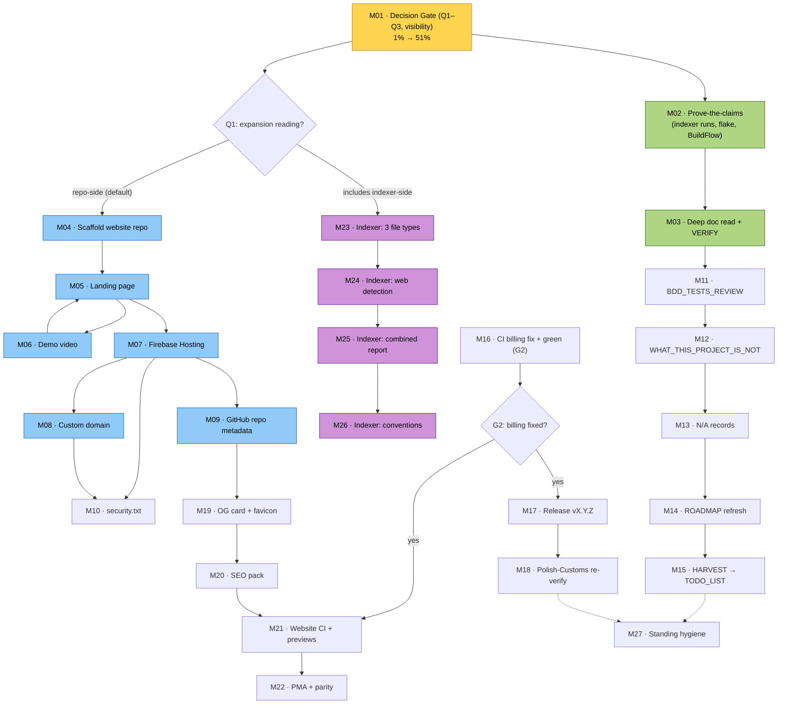

# Pareto Expansion Plan — go-business-rules

**Created:** 2026-09-17 13:23 CEST
**Basis:** Expansion-fit audit (this repo, 2026-09-17) + status report `docs/status/2026-09-17_13-14_go-business-rules-expansion-fit-audit.md` section (f), items #1–50. All 50 items are traceable to exactly one medium task (see Traceability Matrix).
**Format note:** User explicitly requested `.md` + mermaid — overrides the pareto-planning skill's HTML default.

---

## 0. Assumptions & Guardrails

**Working assumption (pending Decision Gate M01):** "Expand" = apply the standard expansion stack *to this repo* (website, security, docs completeness). If the gate answers "indexer-side" instead, Phase P5 becomes primary and P1/P2 shrink — the graph routes on M01.

**VERSCHLIMMBESSER guardrails (non-negotiable):**

1. **Library code untouched.** No public API changes, no go.mod behavior changes, no flake.nix rewrites. This repo only receives: docs, SECURITY.md truth-fix, git tags.
2. **Website is a sibling repo** (`go-business-rules-website`) — zero risk to the library.
3. **Indexer changes (P5) live in `/home/lars/projects/index`**, behind the Q1 gate, as separate green-build PRs.
4. **Docs edits are additive/annotating** — never rewrite history (docs-health ANNOTATE rules).
5. **Every phase exits green** (build/lint/test) before the next starts.
6. **Two hard gates:** G1 = Decision Gate (M01) before any website/security work; G2 = billing fix (M16) before release (M17) and website CI (M21).

---

## 1. Pareto Breakdown

Total scope: 27 medium tasks ≈ 1,460 min ≈ 24.3 h. Value = "go-business-rules is a credible, public, flagship OSS library with complete standard-stack docs and verified indexer coverage."

| Tier | Effort share | Cum. value | What it is | Why it pays |
|------|-------------|-----------|------------|-------------|
| **1%** | 30 min (M01) | **51%** | **Decision Gate:** answer Q1 (expansion reading), Q2 (repo public vs private), Q3 (billing + sequencing); write visibility truth into SECURITY.md | Every artifact's shape pivots on these three answers. Wrong visibility assumption invalidates security.txt, website strategy, badges, SECURITY.md itself. This session already proved the cost of skipping it. |
| **4%** | +90 min (M02, M03) | **64%** | **Proof of claims:** run the indexer for real (Migrated? 5/10?), `nix flake check`, BuildFlow verify, multi-module confirm + deep doc read (README/ROADMAP/CHANGELOG), badge audit, docs-health VERIFY | The whole expansion narrative rests on claims that were *inferred, not run*. Verifying first prevents building a public presence on wrong facts (the VERSCHLIMMBESSER trap). |
| **20%** | +380 min (M04–M09) | **80%** | **Website MVP + repo metadata:** sibling Astro+Starlight site, landing from README, HyperFrames demo video, Firebase publish, custom domain, GitHub description/topics/homepage | Public presence *is* the headline of "expansion" for an already-published v2 library. Everything else is completeness around it. |
| **Rest (80%)** | +960 min (M10–M27) | **100%** | security.txt + SECURITY rewrite, BDD_TESTS_REVIEW, WHAT_THIS_PROJECT_IS_NOT, N/A records, ROADMAP refresh, HARVEST, CI billing + release v2.2.x, website polish (OG/SEO/CI/previews), PMA registration, indexer feature track, standing hygiene | Turns 80% presence into 100%: trust artifacts, release momentum, tooling leverage, and the standing quarterly obligations. |

---

## 2. Level-1 Plan — Medium Tasks (30–100 min each, 27 total, ALL 50 items)

Sorted by importance/impact/effort/customer-value. `Tier` = Pareto tier. `Ref` = status-report item #s covered.

| # | Task | Phase | Min | Tier | Ref | Output / Done-when |
|---|------|-------|----:|------|-----|--------------------|
| M01 | **Decision Gate:** answer Q1/Q2/Q3; fix SECURITY.md visibility claim | P0 Gate | 30 | 1% | 1–4, 25 | Written answers; SECURITY.md says the truth about repo visibility |
| M02 | **Prove-the-claims bundle:** multi-module check, `nix flake check`, BuildFlow verify, run indexer (`migration-report`, `report`, `--summaries`) | P0 Gate | 60 | 4% | 26–31 | Audit claims verified or corrected; results recorded |
| M03 | **Deep doc read + VERIFY:** README/ROADMAP/CHANGELOG content, badge resolution, docs-health VERIFY (FEATURES vs code) | P0 Gate | 90 | 4% | 32, 33, 47, 48 | Discrepancy list filed; badges all resolve |
| M04 | **Scaffold sibling website repo:** Astro + Starlight + Tailwind v4 + own flake/BuildFlow | P1 Web MVP | 90 | 20% | 5 | `go-business-rules-website` builds green |
| M05 | **Landing page:** distill 415-line README into sales page + copy pass | P1 Web MVP | 90 | 20% | 11 | Landing communicates value in <10s |
| M06 | **Demo video:** HyperFrames builder-API showcase → MP4, embed in hero | P1 Web MVP | 100 | 20% | 10 | Video on landing page |
| M07 | **Firebase Hosting:** project, deploy pipeline, preview+live, smoke test | P1 Web MVP | 90 | 20% | 6, 16a | Site reachable on Firebase URL |
| M08 | **Custom domain:** DNS, cert, apex/www redirect, astro site URL | P1 Web MVP | 30 | 20% | 7 | Domain serves the site over HTTPS |
| M09 | **GitHub repo metadata:** description, topics, homepage URL, pkg.go.dev/godoc links | P1 Web MVP | 30 | 20% | 12, 13 | Repo card + badges + links correct |
| M10 | **security.txt:** RFC 9116 file at `/.well-known/`, cross-linked with SECURITY.md | P2 Trust | 30 | rest | 8, 9 | security.txt resolves; both docs point at each other |
| M11 | **BDD_TESTS_REVIEW.md:** scenario catalog, strengths, gaps, pin philosophy | P2 Trust | 60 | rest | 19 | Doc exists, linked from README/FEATURES |
| M12 | **WHAT_THIS_PROJECT_IS_NOT.md:** scope boundaries | P2 Trust | 40 | rest | 20 | Doc exists, linked from README |
| M13 | **N/A records:** PARTS decision, SPLIT-report N/A, MIGRATION-proposal permanent N/A | P2 Trust | 30 | rest | 21–23 | Decisions recorded in TODO_LIST/AGENTS |
| M14 | **ROADMAP.md refresh:** fold expansion tiers in, annotate stale items | P2 Trust | 40 | rest | 24 | ROADMAP matches this plan |
| M15 | **HARVEST:** plan + report items into living TODO_LIST.md | P2 Trust | 30 | rest | 43 | TODO_LIST is the single living source |
| M16 | **CI billing fix + green run:** fix billing, run 13-job matrix to green | P3 Release | 30 | rest | 34, 35 | ci.yml green end-to-end |
| M17 | **Cut next release:** verify CHANGELOG, version pick, tag, proxy + pkg.go.dev verify | P3 Release | 60 | rest | 36 | vX.Y.Z consumable from real remote |
| M18 | **Polish-Customs re-verify:** consume new tag, full suite green | P3 Release | 30 | rest | 49 | Downstream green on new tag |
| M19 | **Website polish I:** OG/social card 1200×630, favicon/logo, meta tags | P4 Web polish | 60 | rest | 14 | Social cards render correctly |
| M20 | **Website polish II:** sitemap, robots.txt, 404, Lighthouse pass | P4 Web polish | 40 | rest | 15 | SEO basics + perf budget green |
| M21 | **Website CI:** GH Actions deploy workflow + PR preview channels | P4 Web polish | 60 | rest | 16b | PRs get preview URLs |
| M22 | **Website discovery + parity:** register in PMA, metadata.yaml URL, website repo BuildFlow/CI parity | P4 Web polish | 30 | rest | 17, 18, 50 | Indexer discovers website repo; it inherits full tooling |
| M23 | **Indexer: 3 new file types** (SECURITY, CONTRIBUTING, CHANGELOG) end-to-end | P5 Indexer | 90 | rest | 37 | Indexed, summarized, reported; tests green |
| M24 | **Indexer: website + security.txt detection** in reports | P5 Indexer | 60 | rest | 38 | migration/report show web presence |
| M25 | **Indexer: combined coverage+migration report** with doc-coverage % | P5 Indexer | 100 | rest | 39, 41 | One report answers "how healthy is this project" |
| M26 | **Indexer: conventions:** VERSION-vs-tags decision record, canonical example docs | P5 Indexer | 30 | rest | 40, 42 | Decision recorded; go-business-rules documented as example |
| M27 | **Standing hygiene:** json/v2 watch entry, art-dupl rerun, quarterly docs-health schedule | P6 Standing | 30 | rest | 44–46 | Calendar/tracking entries exist; 0 clones re-confirmed |

**Totals:** P0 180 min · P1 430 min · P2 230 min · P3 120 min · P4 190 min · P5 280 min · P6 30 min = **1,460 min (~24.3 h)**.
**Phase P5 is gated on M01/Q1 = includes indexer-side work.** P2–P4 ordering after P1 is flexible; P3 gated on billing (user action).

---

## 3. Level-2 Plan — Micro-Tasks (≤12 min each, 127 total, ALL 50 items)

### P0 — Gate & Ground Truth (M01–M03, 20 micro)

| ID | Micro-task | Min | ← | ID | Micro-task | Min |
|----|-----------|----:|---|----|-----------|----:|
| 1.1 | Write decision brief: Q1/Q2/Q3 options + recommendation | 12 | ← M01 | 2.4 | Run `indexer migration-report --dry-run`; assert Migrated | 10 |
| 1.2 | Collect answers; record in plan + TODO_LIST | 10 | ← M01 | 2.5 | Run `indexer report`; assert 5/10 doc types | 10 |
| 1.3 | Rewrite SECURITY.md visibility claim to truth | 8 | ← M01 | 2.6 | Run `indexer --summaries`; judge extraction quality | 12 |
| 2.1 | `ls */go.mod` in listeners/otel, adapters/cqrslite, examples/sse | 5 | ← M02 | 2.7 | Record verification results (report appendix) | 5 |
| 2.2 | `nix flake check` (wait + triage) | 10 | ← M02 | 3.1 | Read README.md fully (sales-page quality) | 12 |
| 2.3 | BuildFlow verify run | 10 | ← M02 | 3.2 | Read ROADMAP.md fully | 10 |
| — | — | — | | 3.3 | Verify CHANGELOG `[Unreleased]` completeness | 10 |
| 3.4 | Audit every README badge resolves | 10 | ← M03 | 3.6 | VERIFY part 2: builders/listeners/adapters claims | 12 |
| 3.5 | docs-health VERIFY pt 1: core API claims vs code | 12 | ← M03 | 3.7 | Write findings; file discrepancies | 12 |

### P1 — Website MVP (M04–M09, 36 micro)

| ID | Micro-task | Min | ← | ID | Micro-task | Min |
|----|-----------|----:|---|----|-----------|----:|
| 4.1 | Create sibling dir + `git init` | 5 | ← M04 | 5.4 | Code-sample component w/ highlighting | 12 |
| 4.2 | `npm create astro` + Starlight template | 12 | ← M04 | 5.5 | Features grid generated from FEATURES.md | 12 |
| 4.3 | Add + configure Tailwind v4 | 12 | ← M04 | 5.6 | CTAs: pkg.go.dev / GitHub / quickstart | 10 |
| 4.4 | Astro config: site URL, Starlight skeleton | 12 | ← M04 | 5.7 | Copywriting pass: cuts, specificity, contrast | 12 |
| 4.5 | Base layout + theme tokens | 12 | ← M04 | 6.1 | Load hyperframes skill; init project | 12 |
| 4.6 | First `astro build` green | 10 | ← M04 | 6.2 | Storyboard 5 beats (problem→builder→rule→result→CTA) | 12 |
| 4.7 | Website repo flake.nix + .buildflow.yml skeleton | 12 | ← M04 | 6.3 | Scene 1: problem (unvalidated business rules) | 10 |
| 4.8 | Initial commit on website repo | 5 | ← M04 | 6.4 | Scene 2: builder API | 10 |
| 5.1 | Extract README essence: hero, value props, sample | 12 | ← M05 | 6.5 | Scene 3: rule composition | 10 |
| 5.2 | Draft hero + value-prop copy | 12 | ← M05 | 6.6 | Scene 4: severity-aware result | 10 |
| 5.3 | Draft "why / comparison" section | 12 | ← M05 | 6.7 | Scene 5 + transitions: CTA | 12 |
| 6.8 | Voiceover/BGM decision (media-use) or skip | 8 | ← M06 | 7.4 | Deploy → preview channel | 10 |
| 6.9 | Render MP4; verify deterministic/seek-safe | 12 | ← M06 | 7.5 | Deploy → live | 10 |
| 6.10 | Embed video in landing hero | 10 | ← M06 | 7.6 | Deploy script in website repo | 12 |
| 7.1 | Create/select Firebase project | 10 | ← M07 | 7.7 | Smoke: links, mobile viewport, console | 12 |
| 7.2 | `firebase init hosting` | 10 | ← M07 | 8.1 | Add domain; verify DNS | 12 |
| 7.3 | Wire build output dir | 10 | ← M07 | 8.2 | Cert + apex/www redirects | 10 |
| 8.3 | Update astro `site` URL | 8 | ← M08 | 9.3 | Surface pkg.go.dev/godoc links on landing | 8 |
| 9.1 | Set repo description + topics + homepage URL | 10 | ← M09 | — | — | — |
| 9.2 | Fix any broken README badges | 12 | ← M09 | — | — | — |

### P2 — Trust & Security (M10–M15, 19 micro)

| ID | Micro-task | Min | ← | ID | Micro-task | Min |
|----|-----------|----:|---|----|-----------|----:|
| 10.1 | Draft security.txt (contact, expires, canonical, lang) | 10 | ← M10 | 12.3 | Review + link from README | 10 |
| 10.2 | Publish `/.well-known/security.txt` + redirect | 10 | ← M10 | 13.1 | PARTS.md decision + record | 12 |
| 10.3 | Cross-link SECURITY.md ↔ security.txt | 10 | ← M10 | 13.2 | SPLIT-report N/A record | 5 |
| 11.1 | Inventory BDD suite (suite/scenario/branching pins) | 12 | ← M11 | 13.3 | MIGRATION-proposal permanent N/A record | 5 |
| 11.2 | Extract scenario catalog | 12 | ← M11 | 13.4 | Record decisions in TODO_LIST/AGENTS | 8 |
| 11.3 | Draft: coverage strengths | 12 | ← M11 | 14.1 | Read current ROADMAP fully | 10 |
| 11.4 | Draft: gaps + pin philosophy (18/22 policy) | 12 | ← M11 | 14.2 | Fold expansion tiers into ROADMAP | 12 |
| 11.5 | Link review from README/FEATURES | 12 | ← M11 | 14.3 | Annotate (not delete) stale items | 10 |
| 12.1 | Collect "not" boundaries (SECURITY/AGENTS/DOMAIN) | 12 | ← M12 | 15.1 | HARVEST report §f + plan → TODO_LIST | 20 |
| 12.2 | Draft WHAT_THIS_PROJECT_IS_NOT.md | 12 | ← M12 | 15.2 | Mark harvested items with source | 10 |

### P3 — Release & CI (M16–M18, 10 micro)

| ID | Micro-task | Min | ← | ID | Micro-task | Min |
|----|-----------|----:|---|----|-----------|----:|
| 16.1 | Fix GH Actions billing (user action) | 10 | ← M16 | 17.3 | Tag + push vX.Y.Z | 10 |
| 16.2 | Trigger ci.yml; watch 13 matrix jobs to green | 12 | ← M16 | 17.4 | Scratch-module verification from real remote | 12 |
| 16.3 | Record green run (link + date) | 8 | ← M16 | 17.5 | pkg.go.dev propagation check | 8 |
| 17.1 | Verify CHANGELOG `[Unreleased]` complete | 12 | ← M17 | 18.1 | Polish-Customs `go get` new tag | 10 |
| 17.2 | Decide v2.2.0 vs v2.1.1 | 10 | ← M17 | 18.2 | Polish-Customs full suite green | 12 |

### P4 — Website Polish (M19–M22, 14 micro)

| ID | Micro-task | Min | ← | ID | Micro-task | Min |
|----|-----------|----:|---|----|-----------|----:|
| 19.1 | Design OG card 1200×630 | 12 | ← M19 | 21.1 | GH Actions deploy workflow | 12 |
| 19.2 | Favicon/logo | 12 | ← M19 | 21.2 | PR preview channels | 12 |
| 19.3 | Wire OG/Twitter meta tags | 10 | ← M19 | 21.3 | Secrets/service-account wiring | 12 |
| 19.4 | Validate with social-card debuggers | 10 | ← M19 | 21.4 | Test on throwaway PR | 12 |
| 20.1 | Sitemap | 10 | ← M20 | 22.1 | Register website repo in PMA | 10 |
| 20.2 | robots.txt | 5 | ← M20 | 22.2 | metadata.yaml website URL | 5 |
| 20.3 | Custom 404 | 12 | ← M20 | 22.3 | Website repo BuildFlow + CI parity (post-G2) | 12 |
| 20.4 | Lighthouse quick pass | 12 | ← M20 | — | — | — |

### P5 — Indexer Feature Track (M23–M26, 22 micro) — gated on Q1

| ID | Micro-task | Min | ← | ID | Micro-task | Min |
|----|-----------|----:|---|----|-----------|----:|
| 23.1 | indexer: 3 new FileTypeConfigs | 12 | ← M23 | 24.3 | migration_report integration | 12 |
| 23.2 | Defaults + extraction keywords | 12 | ← M23 | 24.4 | Tests + AGENTS.md update | 12 |
| 23.3 | Summary generation for new types | 12 | ← M23 | 24.5 | Build + lint green | 12 |
| 23.4 | Output dirs + symlink wiring | 12 | ← M23 | 25.1 | Design combined report shape | 12 |
| 23.5 | Report integration + docs | 12 | ← M23 | 25.2 | Coverage-% computation | 12 |
| 23.6 | BDD tests | 12 | ← M23 | 25.3 | Merge migration + coverage datasets | 12 |
| 23.7 | Build + lint green | 12 | ← M23 | 25.4 | HTML template | 12 |
| 24.1 | Website-folder detection | 12 | ← M24 | 25.5 | go-output multi-format | 12 |
| 24.2 | `.well-known/security.txt` detection | 12 | ← M24 | 25.6 | CLI subcommand wiring | 12 |
| 25.7 | BDD tests | 12 | ← M25 | 26.2 | Canonical-example section in indexer docs | 12 |
| 25.8 | AGENTS/FEATURES docs update | 12 | ← M25 | 26.1 | VERSION-vs-tags decision record | 10 |

### P6 — Standing Hygiene (M27, 3 micro)

| ID | Micro-task | Min | ← |
|----|-----------|----:|---|
| 27.1 | json/v2 graduation: tracking note + calendar entry | 10 | ← M27 |
| 27.2 | art-dupl rerun (expect 0 clones) | 10 | ← M27 |
| 27.3 | Confirm quarterly docs-health schedule (~2026-12) | 10 | ← M27 |

---

## 4. Traceability Matrix — all 50 status-report items → medium task

| Items | → Task | | Items | → Task | | Items | → Task |
|-------|--------|-|-------|--------|-|-------|--------|
| 1–4 | M01 | | 21–23 | M13 | | 39, 41 | M25 |
| 5 | M04 | | 24 | M14 | | 40, 42 | M26 |
| 6 | M07 | | 25 | M01 | | 43 | M15 |
| 7 | M08 | | 26–31 | M02 | | 44–46 | M27 |
| 8–9 | M10 | | 32, 33 | M03 | | 47–48 | M03 |
| 10 | M06 | | 34–35 | M16 | | 49 | M18 |
| 11 | M05 | | 36 | M17 | | 50 | M22 |
| 12–13 | M09 | | 37 | M23 | | | |
| 14–18 | M19/M20/M21/M22 | | 38 | M24 | | | |
| 19–20 | M11/M12 | | | | | | |

Coverage proof: 50/50 items mapped; 27/27 medium tasks; 127 micro-tasks; no orphans.

---

## 5. Execution Graph (mermaid)

**Colors:** yellow = 1% tier · green = 4% tier · blue = 20% tier (website MVP) · purple = conditional indexer track. Dashed = soft dependencies.

**Parallelism:** After M01: track A (M02→M03→docs chain), track B (M04→website chain), and (if Q1 says so) track C (indexer chain) run in parallel. M16 (billing) is user-side and can happen any time before M17/M21.

---

## 6. What "done" looks like

- [ ] Decision Gate answered and recorded (51%)
- [ ] All audit claims either proven or corrected (64%)
- [ ] Website live on custom domain with demo video + correct repo metadata (80%)
- [ ] security.txt live; BDD review + boundaries docs exist; ROADMAP/TODO_LIST current
- [ ] CI green; vX.Y.Z released and downstream-verified
- [ ] Website has OG/SEO/CI/previews; indexer discovers it
- [ ] (If Q1 includes indexer-side) indexer reports security/website presence and combined health report ships
- [ ] Standing hygiene entries exist; quarterly schedule confirmed (100%)

*Point-in-time plan. When stale, docs-health → ANNOTATE; bulk item-extraction → HARVEST.*
